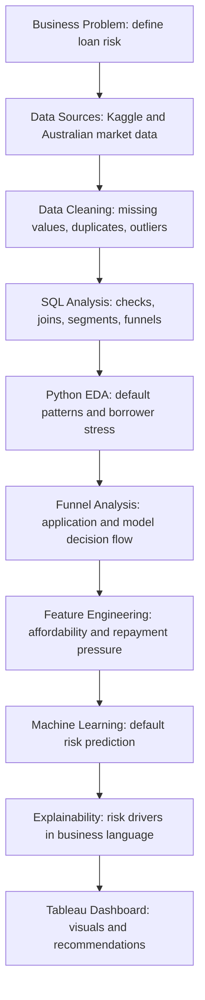

# Australian-Mortgage-Loan-Risk-Analytics
This project studies loan-risk data the way a bank might look at mortgage applicants.
The main question is:

> If a person applies for a loan, what signs suggest they may struggle to repay it?

Because public Australian bank loan-default data is limited, this project uses a messy Kaggle credit-risk dataset for borrower-level modelling, then adds Australian lending and housing context from public sources such as Australian Bureau of statistics (ABS), Australian Prudential Regulation Authority (APRA) , Reserve Bank of Australia (RBA), and NSW housing data.

The final result will show how raw loan data becomes useful business insight through Python, SQL, machine learning, and Tableau dashboards.
## Business Problem

Australian banks need to manage the risk that some borrowers may miss payments or default on their loans. This project builds a practical analytics workflow to identify higher-risk applicants and explain the main drivers of risk.

Example business questions:

- Which borrower groups are more likely to default?
- Does income, loan size, employment history, or repayment burden affect risk?
- How can a bank separate low-risk, medium-risk, and high-risk applicants?
- What should be reviewed manually before a loan is approved?
- How do Australian housing and lending conditions add context to borrower risk?

## Tools And Skills Demonstrated

| Tool | How It Will Be Used | Skills Shown |
|---|---|---|
| Python | Data cleaning, EDA, feature engineering, machine learning, model evaluation | pandas, NumPy, scikit-learn, plotting, ML workflow |
| SQL | Data profiling, joins, aggregations, window functions, funnel queries, risk segmentation | beginner to advanced business SQL |
| Tableau | Final dashboard, funnel charts, risk segments, trend analysis, stakeholder visuals | dashboard design, calculated fields, parameters, filters |
| GitHub | Project documentation, clean repo structure, reproducible workflow | communication, version control, portfolio presentation |

## Portfolio Flow

## Project Layers

## Project Layers

| Layer | What It Means In Plain English | Benefit |
|---|---|---|
| 1. Business Problem | Define what loan risk means and why a bank cares | Shows domain thinking |
| 2. Data Sourcing | Bring together Kaggle loan data and Australian market data | Shows real-world data sourcing |
| 3. Data Cleaning | Fix missing values, messy categories, duplicates, and outliers | Shows practical analyst skill |
| 4. SQL Analysis | Query the cleaned data like a business analyst would | Shows database and reporting skill |
| 5. Python EDA | Explore patterns in default, income, employment, and repayments | Shows insight generation |
| 6. Funnel Analysis | Show how applicants move through data quality, approval, and risk stages | Shows stakeholder storytelling |
| 7. Feature Engineering | Create useful risk signals from raw columns | Shows analytical creativity |
| 8. Machine Learning | Predict default risk using classification models | Shows ML capability |
| 9. Explainability | Explain why the model flags certain borrowers as risky | Shows responsible analytics |
| 10. Tableau Dashboard | Present insights clearly for non-technical users | Shows communication and visual design |

## Funnel Charts Planned

Funnel charts are useful because they explain movement from a large group to a smaller, more important risk group.

Planned funnel examples:

- **Data quality funnel:** raw records -> valid records -> modelling-ready records.
- **Loan application funnel:** total applicants -> eligible applicants -> approved applicants -> high-risk approved applicants.
- **Risk outcome funnel:** active loans -> late payments -> delinquent loans -> defaulted loans.
- **Model decision funnel:** scored applicants -> low risk -> medium risk -> high risk -> manual review.

## SQL Learning Path Inside This Project

This project will include SQL scripts that move from beginner to advanced:

1. Basic `SELECT`, `WHERE`, `ORDER BY`, and filtering.
2. Aggregations using `COUNT`, `SUM`, `AVG`, `MIN`, and `MAX`.
3. Grouped default-rate analysis using `GROUP BY`.
4. Data quality checks for duplicates, missing values, and invalid records.
5. Joins between borrower, loan, and market-context tables.
6. Common table expressions using `WITH`.
7. Window functions such as `ROW_NUMBER`, `RANK`, and rolling averages.
8. Risk segmentation using `CASE WHEN`.
9. Funnel queries for application and model-stage reporting.
10. Advanced analytical queries for cohort analysis and model monitoring.

## Tableau Dashboard Plan

Planned dashboard pages:

- Executive summary: key risk metrics and default rate.
- Applicant funnel: movement from raw applications to high-risk applicants.
- Borrower risk profile: income, loan size, repayment burden, employment history.
- Model performance: confusion matrix, risk bands, recall, precision.
- Australian market context: lending trends, interest-rate pressure, housing indicators.
- Manual review view: applicants that may need closer checking.

Planned Tableau techniques:

- Funnel charts.
- Parameter-driven risk thresholds.
- Calculated fields for risk bands.
- Highlight actions.
- Dynamic titles.
- Tooltip storytelling.
- Dashboard navigation buttons.
- Clean banking-style layout with simple colours and strong labels.

## Data Sources

Primary borrower-level dataset options:

- Kaggle Home Credit Default Risk
- Kaggle Lending Club loan data
- Kaggle Credit Risk Dataset

Australian context data:

- Australian Bureau of Statistics lending indicators
- APRA authorised deposit-taking institution statistics
- Reserve Bank of Australia statistical tables
- NSW property sales information
- NSW rental bond lodgement and refund data

## Planned Outputs

- Clean GitHub README.
- Python notebooks for audit, cleaning, EDA, modelling, and explainability.
- SQL scripts from beginner to advanced.
- Tableau dashboard plan and exported dashboard screenshots.
- Funnel charts and risk segmentation visuals.
- Machine learning model comparison.
- Final business recommendations and project limitations.
